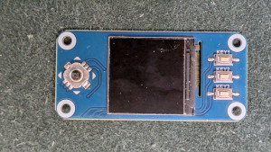

# GShockTimeServer

## Overview

GShockTimeServer allows you to set the correct time on your Casio G-Shock watches. Most G-Shock and other Casio Bluetooth watches are supported. Please give us feedback if your watch does not work.

## Usage

This app can run on any device with Python and Bluetooth capabilities—from a desktop to a Raspberry Pi Zero.  
It has been tested on Linux but should also work on Windows.


### Setting the Time

1. Ensure the app is running on your device.
2. Short-press the **lower-right** button on your G-Shock watch to connect.
3. Once connected, the app will automatically set the correct time on your watch.
4. If **AUTO TIME ADJUSTMENT** is enabled, the watch will sync up to **four times daily**.

## Manual Minimal Setup

If you like to run the Time Server on any Linux or Windows PC, here os how to do it. First you need to install
the follwoing dependencies:

```
pytz
bleak
gashock-api
```

You can install them using the following command:

```bash
pip3 install -r requirements.txt
```

Then run:

```bash
python3 src/gshock_server.py [--fine-adjustment-secs secs]
```

The optional `--fine-adjustment-secs` alows you to fine adjust the time setting by providing an offset in seconds. For example:
```
python3 src/gshock_server.py --fine-adjustment-secs -9
```
will set the watches time 9 secods vefore the computer's time.

## Adding a Display

If you're running the server on a Raspberry Pi Zero or another Pi model, you can attach a small SPI-based LCD display to visually monitor the system status.

➡️ If you're using a Pi Zero, make sure to get a model with a pre-soldered 40-pin GPIO header, such as [this one](https://amzn.to/3GA6nIR).

---

### Running the Display-Enabled Script

To use a display, run this variant of the server:

```bash
python3 src/gshock_server_display.py [--fine-adjustment-secs SECS] --display waveshare|tft154|mock
```

✅ Key differences:

    Use gshock_server_display.py instead of gshock_server.py.

    Add the --display argument to select the display type:

        waveshare — for Waveshare 1.3" HAT

        tft154 — for generic 1.54" ST7789 SPI screen

        mock — no hardware, output goes to oled_preview.png (useful for development)

#### Installing Display Dependencies

Using a display requires several additional libraries (Pillow, luma.lcd, RPi.GPIO, etc.).

Instead of installing them manually, run:

./setup-display.sh

This script will:

    Install all required Python packages and fonts

    Set up the gshock service to start automatically on boot

More details are available in the setup-display.sh script.
What the Display Shows

    ✅ Welcome Screen
    Displays the current watch name and last sync time.

    Welcome Screen

    🔗 Connected Screen
    Shown briefly when a new connection with the watch is established.

    Connected Screen

    🕒 Detailed Info Screen
    Shows details about the last connected watch, including time of last sync, next alarm, and reminder.

    Detailed Screen

## Hardware
Currently we support the following 240x240 color displays:

| Display Type | Description                                    | Notes                                      |
|--------------|------------------------------------------------|--------------------------------------------|
| `waveshare`  | Waveshare 1.3" SPI LCD module HAT, ST7789 Controller  | Widely available color display. Directly plugs into the Pi's 40-pin header. [Buy on Amazon](https://amzn.to/4eZDRNl) |
| `tft154`     | 1.54" TFT SPI LCD, ST7789 Controller            | Inexpensive generic display. Requires jumper wires to connect to GPIO header. [Buy Display](https://amzn.to/3IRtaAl), [Buy Jumper Wires](https://amzn.to/4eXT55D) |
| `mock`       | No physical display                            | Simulates a display to oled_preview.png. Useful during development or headless testing |

---

### Waveshare 1.3" SPI LCD module HAT

  


This is the easiest option to set up. It has a female 40-pin connector that mates directly with the Pi's GPIO header—no wiring needed and fewer connection errors.

👉 [Buy on Amazon (affiliate)](https://amzn.to/4eZDRNl)

---

### 1.54" TFT SPI LCD, ST7789 Controller

  


This is a lower-cost generic display with the same ST7789 driver chip. It must be wired using jumper cables to the correct GPIO pins. See [Connecting the 1.54" TFT SPI LCD to Raspberry Pi](#connecting-the-154-tft-spi-lcd-to-raspberry-pi) for instructions.

👉 [Buy Display](https://amzn.to/3IRtaAl)  
👉 [Buy Jumper Wires](https://amzn.to/4eXT55D)


## Automatic Setup

To facilitate the installation, we provide several scripts to allow you to install all necessary files on an SD card created with the [Raspberry Pi Imager](https://www.raspberrypi.com/software/). Here are the steps:

1. Use an SD card with a minimum of 4GB size and create your image using the Imager. Select your device, OS (select Lite), and your storage. Don't forget to set your Wi-Fi network and password, and make sure SSH is enabled. Use the flashed SD card to boot your Pi device and SSH into it.

2. Next we need to get the software from a GitHub repository. To do that, first install the `git` package on your device:

```
sudo apt-get install git
```
and then get the software:
```
git clone https://github.com/izivkov/gshock-server-dist.git
```

This will create a directory `gshock-server-dist` containing a number of shell scripts needed to set up the server. Note that running the scripts takes relativey long time. In the Pi 3/4, typically half an hour. On the Pi Zero, let it run overnight ;-). 

The scripts are described below:

### setup.sh

This script installs the basic software, dependencies, sets up a service to start the server each time the device is rebooted, etc. For a device with no display, this is sufficient to run the server.

### setup-display.sh
Installs all display-related dependencies. While installing, it will ask you to select the display type.

Note: You need to run both setup.sh and setup-display.sh.

### gshock-updater.sh

(Optional) This script will set the device to automatically update its software if a new version is available on GitHub.
It will then restart the server, so you will always be running the latest version. The scripts sets us a cron job to
run periodically and check for new tags on the `gshock-server-dist` GitHub repository.

### enable-spi.sh
This script will enable the Linux driver needed for the display. Without this step, the display will not work. Reboot when asked after the script runs.

### setup-all.sh
Runs all the scripts above in one step.

## Connecting the 1.54"-TFT-SPI LCD to Raspberry Pi

Here is how to connect the `1.54"-TFT-SPI LCD` to Rasoberry Pi 40-pin header:

| LCD pin             | Purpose             | Raspberry Pi physical pin | Pi BCM GPIO | Notes                                                |
| ------------------- | ------------------- | ------------------------- | ----------- | ---------------------------------------------------- |
| **VCC**             | 3.3 V supply        | **1** (3V3)               | —           | The ST7789 is 3.3 V‑only—**never feed 5 V**          |
| **GND**             | Ground              | **6** (GND)               | —           | Any ground pin is fine                               |
| **SCL** or **CLK**  | SPI clock (SCLK)    | **23** (GPIO 11)          | GPIO 11     | Part of SPI0                                         |
| **SDA** or **MOSI** | SPI data (MOSI)     | **19** (GPIO 10)          | GPIO 10     | Display is write‑only, so MISO isn’t used            |
| **CS**              | Chip‑select         | **24** (GPIO 8 / CE0)     | GPIO 8      | Or pin 26 (CE1 / GPIO 7) if you prefer               |
| **DC** (A0, D/C)    | Data/Command select | **18**                    | GPIO 24     | Any free GPIO works—update your code accordingly     |
| **RES** (RST)       | Hardware reset      | **22**                    | GPIO 25     | Tie to 3 V3 if you don’t need GPIO reset             |
| **BL** (LED)        | Back‑light          | **12** (GPIO 18)          | GPIO 18     | Drive with PWM to dim, or link to 3 V3 for always‑on |

You need to enable SPI on the Pi (this is already done in the setup scripts `enable-spi.sh` shown bellow, so you don't have to do it manually)
```
sudo raspi-config            # Interface Options ▸ SPI ▸ Enable
sudo reboot
```


## Troubleshooting
If your watch is not connecting, remove `config.ini` file and try again. 

To see output from the service do:
```
journalctl -u gshock.service -f
```


