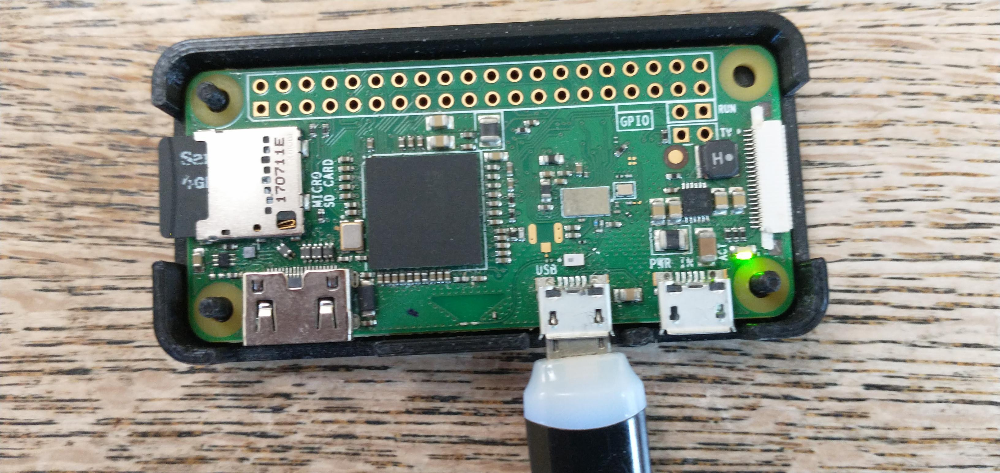

# GShockTimeServer

## Announcement

This project is now split into two separate repositories:

- **GShockTimeServer**
- **gashock_api**

The **GShockTimeServer** repository contains the server-side code for setting the time on your G-Shock watch.

The **gashock_api** repository can be found [here](https://github.com/izivkov/gshock_api), and contains a Python API library for developing applications for these watches. Please refer to the **gashock_api** repository for the latest updates and documentation.

If you just like to include the API in your project, you can install it using pip:

```bash
pip install gashock-api
```

## Overview

GShockTimeServer allows you to set the correct time on your Casio G-Shock watches. Most G-Shock and other Casio Bluetooth watches are supported. Please give us feedback if your watch does not work.

## Usage

This app can run on any device with Python and Bluetooth capabilities—from a desktop to a Raspberry Pi Zero.  
It has been tested on Linux but should also work on Windows.



### Setting the Time

1. Ensure the app is running on your device.
2. Short-press the **lower-right** button on your G-Shock watch to connect.
3. Once connected, the app will automatically set the correct time on your watch.
4. If **AUTO TIME ADJUSTMENT** is enabled, the watch will sync up to **four times daily**.

## Dependencies

This project requires the following Python packages:

```
pytz
bleak
gashock-api
```

You can install them using the following command:

```bash
pip3 install -r requirements.txt
```

Then run:

```bash
python3 src/gshock_server.py [--multi-watch] [--fine-adjustment-secs secs]
```

The optional `--multi-watch` parameter allows you to connect if you have multiple watches.
The optional `--fine-adjustment-secs` alows you to fine adjust the time setting by providing an offset in seconds. For example:
```
python3 src/gshock_server.py --fine-adjustment-secs -9
```
will set the watches time 9 secods vefore the computer's time.

## Troubleshooting
If your watch is not connecting, remove `config.ini` file and try again.

## Seting up service to start the server at boot-time

🔹 1. Create a systemd service file

Create a file at /etc/systemd/system/gshock.service:
```
sudo nano /etc/systemd/system/gshock.service
```

Paste this (adjust paths if needed):
```
[Unit]
Description=G-Shock Server Python App
After=network.target bluetooth.target

[Service]
Type=simple
User=pi
WorkingDirectory=/home/pi/gshock-server-dist
ExecStart=/usr/bin/python3 /home/pi/gshock-server-dist/gshock_server.py --multi-watch
Restart=on-failure
Environment=PYTHONUNBUFFERED=1

[Install]
WantedBy=multi-user.target
```

🔹 3. Reload systemd to recognize the new service
```
sudo systemctl daemon-reload
```

🔹 4. Enable the service to start at boot
```
sudo systemctl enable gshock.service
```

🔹 5. Start it now (optional test)
```
sudo systemctl start gshock.service
```

Check if it’s working:
```
sudo systemctl status gshock.service
```


