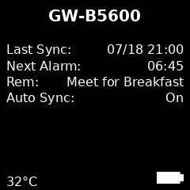

# GShockTimeServer

## 1. Overview

### What the project does.
**ShockTimeServer** automatically sets the correct time on your Casio G-Shock watches. Like your G-Shock itself, it’s designed to be set-and-forget. Just start the server once—it will run reliably for months with no user intervention.

The server can run on a Raspberry Pi device with a small LSD display, ot can run headless on any device with Bluetooth and Python.

💡 Note: Here we refer to Raspberry Pi, but the same instructions apply to other Pi-like devices, like Banana-Pi and other hardware compatible devices.

[](https://youtu.be/esZWTlzKvus)

### Supported watch types

Most G-Shock and other Casio Bluetooth watches are supported. Here is a list of supported watches:
G(M)W-5600, G(M)W-5000, GA-B2100, GA-B001-1AER, GST-B500, GST-B200, MSG-B100, G-B001, GBD-H1000 (Partial support), MRG-B5000, GST-B600, GCW-B5000, GG-B100, ABL-100WE, Edifice ECB-30, ECB-10, ECB-20, most Edifice watches, most Protrek models.

Let us know if it works with other watches, and if you like us to add support for your watch.

### How it works at a high level

The server waits for watches to connect vial Bluetooth, and sends them the time once connected. 

## 2. Features

- Automatic time sync

- Multi-watch support

- Optional display support

- Raspberry Pi integration

- GitHub auto-updates (if applicable)

### Usage

1. Start the server:
2. Short-press the **lower-right** or long-press the **lower-left** button on your G-Shock watch to connect.
3. Once connected, the app will automatically set the correct time on your watch.
4. If **AUTO TIME ADJUSTMENT** is enabled, the watch will sync up to **four times daily**.

## 3. Quick Start

💡 Note: In addition to this repository, we have created another repo on GitHub (https://github.com/izivkov/gshock-server-dist), specifically for distribution. It holds all the files nessecary to run the server and no more. This repository is preffereable for getting the distribution files, since ot also controlles versioning. Installing dependencies for the display can get a but complex, so se provide setup scripts, which use this repository to automatically set up your device.

### Headless

💡 Note: There are two versions of the server:

gshock_server.py – for headless use (no display)

gshock_server_display.py – for devices with an attached display

To quickly get started with the headless server (on a device without a display), follow the steps below. For a more thorough and permanent installation, refer to the setup scripts described later in this document.

- First you need to install the follwoing dependencies:

```
pytz
bleak
gashock-api
```

You can install them using the following command:

```bash
pip3 install -r requirements.txt
```

Then run:

```bash
python3 src/gshock_server.py [--fine-adjustment-secs secs]
```

The optional `--fine-adjustment-secs` alows you to fine adjust the time setting by providing an offset in seconds. For example:
```
python3 src/gshock_server.py --fine-adjustment-secs -9
```
will set the watches time 9 secods before the computer's time.

### 3.2 On Raspberry Pi with Display

On the Pi devices, you can also connect a small LCD display to monitor the operation of the server.


Pi Zero with **Waveshare** display


Pi 3 with **1.54" TFT SPI LCD** display

These instructions will guide you how to start from a blank SD card and install all you need to run the server on Pi 3/4 or Pi zero.

<a href="https://www.raspberrypi.com/software/" target="_blank" rel="noopener noreferrer">Raspberry Pi Imager</a>

Use an SD card with a minimum of 4GB size and create your image using the Imager. Select your device, OS (select Lite), and your storage. Don't forget to set your Wi-Fi network and password, and make sure SSH is enabled. 

#### Installing git and cloning the repo

Use the flashed SD card to boot your Pi device and SSH into it. Next we need to get the software from a GitHub repository. To do that, first install the `git` package on your device:

```
sudo apt-get install git
```
and then get the software:
```
git clone https://github.com/izivkov/gshock-server-dist.git
```

This will create a directory `gshock-server-dist` containing a number of shell scripts needed to set up the server. Note that running the scripts takes relativey long time. In the Pi 3/4, typically half an hour. On the Pi Zero, let it run overnight ;-).

> **Pro Tip:** If you have another Raspberry Pi device in addition to the Pi Zero, you can set up the server on that device and use the **same SD card** on both.  
> The key is to use a **32-bit OS** when creating the image with Raspberry Pi Imager, as it ensures compatibility across all Pi models, including the Pi Zero.

## Using the pre-built image

1. Download and unzip [pi.zip](https://github.com/izivkov/GShockTimeServer/releases/download/pi_image/pi.zip).

2. Use the Raspberry PI Imager to flash to SD card

- Chose your target device
- For OS chose "Use Custom", and select the uncompressed image file pi.img
- Select as storage a new SD you have mounted
- Click NEXT, and edit your settings. Here you can enter your networks SSID and password. Also, from the Services tab, enable SSH.
- Apply settings when asked, and flash you SD. You should be able to now boot your Pi.
- After booting yout Pi, you might have to manually set the display type in file `/etc/systemd/system/gshock.service` if it does not match your display. In this case, reboot again and you should see the initial screen,

## Setup Scripts

```
cd gshock-server-dist
```

### setup.sh

This script installs the basic software, dependencies, creates Python virtual environment, sets up a service to start the server each time the device is rebooted, etc. For a device with no display, this is sufficient to run the server. 

### setup-display.sh

Installs all display-related dependencies, such as `luma, spidev, numpy, pillow`. While installing, it will ask you to select the display type. 

If you enter the wrong display type, you can change it later by editing the file `/etc/systemd/system/gshock.service` and change the `--display` pareamert value to one of `waveshare`, ``tft154` or `mock`.

💡 Note: You need to run both `setup.sh` and `setup-display.sh`.

### gshock-updater.sh (Optional)

This script will set the device to automatically update its software if a new version is available on GitHub.
It will then restart the server, so you will always be running the latest version. The scripts sets us a cron job to
run periodically and check for new tags on the `gshock-server-dist` GitHub repository. We recommend running this script, because we plan on adding new features soon.

### enable-spi.sh

This script will enable the Linux driver needed for the display. Without this step, the display will not work. Reboot when asked after the script runs. 

### setup-all.sh

Runs all the scripts above in one step.

## Using the Server

If you have used the scripts to install the software, a service file `/etc/systemd/system/gshock.service` will be created. This will start the server automatically when rebooting. 

## Ignoring Specific Watches

You may have some watches that you prefer **not** to connect to the server. For example, certain Edifice models attempt to connect frequently, which can interfere with connections from other watches.

To prevent the server from connecting to specific models, you can manually list them in your `config.ini` file, ocated at $HOME/.config/gshock/config.ini, under the `excluded_watches` setting:

```ini
excluded_watches = ["DW-H5600", "OCW-S400", "OCW-S400SG", "OCW-T200SB", "ECB-30", "ECB-20", "ECB-10", "ECB-50", "ECB-60", "ECB-70"]
```

Then restart the service for the changes to take effect:
```
sudo systemctl restart gshock.service
```

### Connecting Your Watch

Short-press the **lower-right** or long-press the **lower-left** button on your G-Shock watch to connect. The watch will connect the its correct time will be set by the server. The watch then will be disconnected. If you use the **lower-left** buton, in addition to setting time, the display on the Pi device will be updated with information about the current state of the watch. **lower-right** button will just update the time.

If your watch is set for auto-update time, the watch will connect automaticlly and update its time every 6 hours.

## Adding a Display

### Running the Display Script

If you have not set the serivce to start your server at boot time, you can start it manually:

```bash
python3 src/gshock_server_display.py [--fine-adjustment-secs SECS] --display [waveshare|tft154|mock]
```

For development without a physical display, you can select the `mock` display option. You can then watch file `oled_preview.png` being created and modified in the root directory of the project.

### What the Display Shows

✅ Welcome Screen


Displays the current watch name and last sync time.

🔗 Connected Screen


Shown briefly when a new connection with the watch is established.

🕒 Detailed Info Screen



Shows details about the last connected watch, including time of last sync, next alarm, and reminder.

## Hardware

### Supported Display Types

If you're running the server on a Raspberry Pi Zero or another Pi model, you can attach a small SPI-based LCD display to visually monitor the system status.

➡️ If you're using a Pi Zero, make sure to get a model with a pre-soldered 40-pin GPIO header, such as [this one](https://amzn.to/3GA6nIR).

Currently we support the following 240x240 color displays:

| Display Type | Description                                    | Notes                                      |
|--------------|------------------------------------------------|--------------------------------------------|
| `waveshare`  | [Waveshare 1.3" SPI LCD module HAT, ST7789 Controller](https://amzn.to/4eZDRNl)  | Widely available color display. Directly plugs into the Pi's 40-pin header.|
| `tft154`     | [1.54" TFT SPI LCD, ST7789 Controller](https://amzn.to/3TSXM70)            | Inexpensive generic display. Requires jumper wires to connect to GPIO header. |
| `mock`       | No physical display                            | Simulates a display to oled_preview.png. Useful during development or headless testing |


### Waveshare 1.3" SPI LCD module HAT

  


This is the easiest option to set up. It has a female 40-pin connector that mates directly with the Pi's GPIO header—no wiring needed and fewer connection errors.

👉 You can get it [here](https://amzn.to/4eZDRNl)

### 1.54" TFT SPI LCD, ST7789 Controller

  


This is a lower-cost generic display with the same ST7789 driver chip. It must be wired using jumper cables to the correct GPIO pins.

👉 You can get the display [here](https://amzn.to/3TSXM70)  
👉 And the Jumper Wires [here](https://amzn.to/4eXT55D)

Here is how to connect the `1.54"-TFT-SPI LCD` to Rasoberry Pi 40-pin header:

| LCD pin             | Purpose             | Raspberry Pi physical pin | Pi BCM GPIO | Notes                                                |
| ------------------- | ------------------- | ------------------------- | ----------- | ---------------------------------------------------- |
| **VCC**             | 3.3 V supply        | **1** (3V3)               | —           | The ST7789 is 3.3 V‑only—**never feed 5 V**          |
| **GND**             | Ground              | **6** (GND)               | —           | Any ground pin is fine                               |
| **SCL** or **CLK**  | SPI clock (SCLK)    | **23** (GPIO 11)          | GPIO 11     | Part of SPI0                                         |
| **SDA** or **MOSI** | SPI data (MOSI)     | **19** (GPIO 10)          | GPIO 10     | Display is write‑only, so MISO isn’t used            |
| **CS**              | Chip‑select         | **24** (GPIO 8 / CE0)     | GPIO 8      | Or pin 26 (CE1 / GPIO 7) if you prefer               |
| **DC** (A0, D/C)    | Data/Command select | **18**                    | GPIO 24     | Any free GPIO works—update your code accordingly     |
| **RES** (RST)       | Hardware reset      | **22**                    | GPIO 25     | Tie to 3 V3 if you don’t need GPIO reset             |
| **BL** (LED)        | Back‑light          | **12** (GPIO 18)          | GPIO 18     | Drive with PWM to dim, or link to 3 V3 for always‑on |

You also need to enable SPI on the Pi. This should already be done by the `enable-spi.sh` script, but here is how to do it manually
```
sudo raspi-config            # Interface Options ▸ SPI ▸ Enable
sudo reboot
```

## Troubleshooting

If your watch is not connecting, remove `config.ini` file and try again. 

To see output from the service do:
```
journalctl -u gshock.service -f
```


